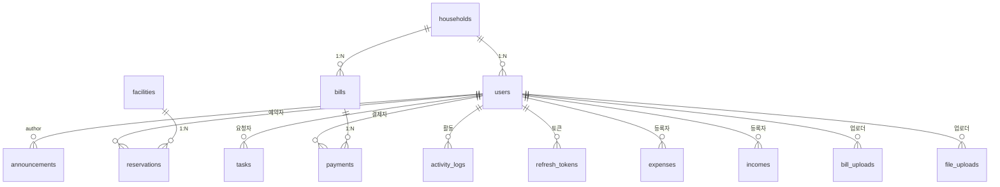

# 📊 Bolivia App 데이터베이스 테이블 구조

> **Database**: `bolivia_db` (MySQL 8.0, utf8mb4)  
> **최종 업데이트**: 2026-03-09

---

## 테이블 요약

| # | 테이블명 | 건수 | 설명 |
|---|---|---|---|
| 1 | `users` | 16 | 사용자(주민, 관리자) 정보 |
| 2 | `households` | 24 | 세대 정보 |
| 3 | `announcements` | 14 | 공지사항 |
| 4 | `bills` | 18 | 월별 관리비 청구서 |
| 5 | `bill_uploads` | 10 | 일괄 청구 업로드 |
| 6 | `payments` | 14 | 결제 정보 |
| 7 | `expenses` | 14 | 지출 내역 |
| 8 | `incomes` | 14 | 수입 내역 |
| 9 | `facilities` | 15 | 시설 정보 |
| 10 | `reservations` | 14 | 시설 예약 |
| 11 | `tasks` | 14 | 작업 및 유지보수 |
| 12 | `activity_logs` | 10 | 활동 로그 |
| 13 | `file_uploads` | 10 | 파일 업로드 |
| 14 | `refresh_tokens` | 1 | 리프레시 토큰 |
| 15 | `flyway_schema_history` | 4 | Flyway 마이그레이션 이력 |

---

## 테이블 상세

### 1. `users` — 사용자(주민, 관리자) 정보

| 컬럼 | 타입 | NULL | 키 | 기본값 | 비고 |
|---|---|---|---|---|---|
| `id` | bigint | NO | PK | auto_increment | |
| `household_id` | bigint | YES | FK→households | NULL | |
| `apt_code` | varchar(32) | NO | UQ | 'BOLIVIA' | 단지 코드 |
| `dong` | varchar(10) | NO | UQ | | 동 |
| `ho` | varchar(10) | NO | UQ | | 호 |
| `display_name` | varchar(100) | NO | | | 표시 이름(닉네임) |
| `username` | varchar(64) | — | UQ | **GENERATED** | `apt_code-dong-ho` 자동 생성 |
| `email` | varchar(255) | NO | UQ | | 로그인 이메일 |
| `password_hash` | varchar(255) | NO | | | BCrypt 암호화 |
| `phone_number` | varchar(20) | YES | | NULL | 휴대폰 번호 |
| `role` | enum('RESIDENT','ADMIN') | NO | IDX | 'RESIDENT' | |
| `status` | enum('PENDING','ACTIVE','LOCKED') | NO | IDX | 'PENDING' | |
| `last_login_at` | timestamp | YES | | NULL | |
| `created_at` | timestamp | YES | | CURRENT_TIMESTAMP | |
| `updated_at` | timestamp | YES | | CURRENT_TIMESTAMP | on update |

---

### 2. `households` — 세대 정보

| 컬럼 | 타입 | NULL | 키 | 기본값 | 비고 |
|---|---|---|---|---|---|
| `id` | bigint | NO | PK | auto_increment | |
| `building_number` | varchar(50) | NO | UQ | | 동 번호 |
| `unit_number` | varchar(50) | NO | UQ | | 호 번호 |
| `owner_name` | varchar(100) | YES | | NULL | 소유자명 |
| `phone_number` | varchar(20) | YES | | NULL | |
| `move_in_date` | date | YES | | NULL | 입주일 |
| `created_at` | timestamp | YES | | CURRENT_TIMESTAMP | |
| `updated_at` | timestamp | YES | | CURRENT_TIMESTAMP | on update |

> **UNIQUE KEY**: `uq_household(building_number, unit_number)`

---

### 3. `announcements` — 공지사항

| 컬럼 | 타입 | NULL | 키 | 기본값 | 비고 |
|---|---|---|---|---|---|
| `id` | bigint | NO | PK | auto_increment | |
| `author_id` | bigint | NO | FK→users | | 작성자 |
| `title` | varchar(255) | NO | | | 제목 |
| `content` | text | NO | | | 내용 |
| `category` | enum('일반','긴급','정기점검','행사','기타') | NO | IDX | '일반' | |
| `is_pinned` | tinyint(1) | YES | IDX | 0 | 상단 고정 |
| `is_active` | tinyint(1) | YES | IDX | 1 | 활성 여부 |
| `view_count` | int | YES | | 0 | 조회수 |
| `attachment_url` | varchar(500) | YES | | NULL | 첨부파일 |
| `start_date` | date | YES | IDX | NULL | 게시 시작일 |
| `end_date` | date | YES | | NULL | 게시 종료일 |
| `created_at` | timestamp | YES | | CURRENT_TIMESTAMP | |
| `updated_at` | timestamp | YES | | CURRENT_TIMESTAMP | on update |

---

### 4. `bills` — 월별 관리비 청구서

| 컬럼 | 타입 | NULL | 키 | 기본값 | 비고 |
|---|---|---|---|---|---|
| `id` | bigint | NO | PK | auto_increment | |
| `household_id` | bigint | NO | FK→households | | |
| `bill_month` | varchar(7) | NO | IDX | | 'YYYY-MM' |
| `due_date` | date | NO | IDX | | 납부 기한 |
| `total_amount` | decimal(12,2) | NO | | | 총 금액 |
| `paid_amount` | decimal(12,2) | YES | | 0.00 | 납부 금액 |
| `status` | enum('미납','완납','부분납') | NO | IDX | '미납' | |
| `general_fee` | decimal(10,2) | YES | | 0.00 | 일반관리비 |
| `security_fee` | decimal(10,2) | YES | | 0.00 | 경비비 |
| `cleaning_fee` | decimal(10,2) | YES | | 0.00 | 청소비 |
| `elevator_fee` | decimal(10,2) | YES | | 0.00 | 승강기비 |
| `electricity_fee` | decimal(10,2) | YES | | 0.00 | 전기료 |
| `water_fee` | decimal(10,2) | YES | | 0.00 | 수도료 |
| `heating_fee` | decimal(10,2) | YES | | 0.00 | 난방비 |
| `repair_fund` | decimal(10,2) | YES | | 0.00 | 수선충당금 |
| `insurance_fee` | decimal(10,2) | YES | | 0.00 | 보험료 |
| `other_fee` | decimal(10,2) | YES | | 0.00 | 기타 |
| `notes` | text | YES | | NULL | 비고 |
| `created_at` | timestamp | YES | | CURRENT_TIMESTAMP | |
| `updated_at` | timestamp | YES | | CURRENT_TIMESTAMP | on update |

---

### 5. `bill_uploads` — 일괄 청구 업로드

| 컬럼 | 타입 | NULL | 키 | 기본값 | 비고 |
|---|---|---|---|---|---|
| `id` | bigint | NO | PK | auto_increment | |
| `file_name` | varchar(255) | NO | | | 파일명 |
| `file_path` | varchar(500) | NO | | | 파일 경로 |
| `upload_month` | varchar(7) | NO | IDX | | 대상 월 |
| `total_records` | int | YES | | 0 | 전체 건수 |
| `processed_records` | int | YES | | 0 | 처리 건수 |
| `failed_records` | int | YES | | 0 | 실패 건수 |
| `status` | enum('업로드됨','검증중','검증완료','처리중','완료','실패') | NO | IDX | '업로드됨' | |
| `validation_errors` | json | YES | | NULL | 검증 오류 |
| `uploaded_by` | bigint | NO | FK→users | | 업로드 사용자 |
| `processed_at` | timestamp | YES | | NULL | 처리 완료 시각 |
| `created_at` | timestamp | YES | | CURRENT_TIMESTAMP | |
| `updated_at` | timestamp | YES | | CURRENT_TIMESTAMP | on update |

---

### 6. `payments` — 결제 정보

| 컬럼 | 타입 | NULL | 키 | 기본값 | 비고 |
|---|---|---|---|---|---|
| `id` | bigint | NO | PK | auto_increment | |
| `bill_id` | bigint | NO | FK→bills | | |
| `user_id` | bigint | NO | FK→users | | |
| `payment_amount` | decimal(12,2) | NO | | | 결제 금액 |
| `payment_method` | enum('신용카드','계좌이체','현금','가상계좌') | NO | | | |
| `payment_status` | enum('대기','완료','취소','실패') | NO | IDX | '대기' | |
| `transaction_id` | varchar(100) | YES | UQ | NULL | 거래 번호 |
| `payment_date` | timestamp | NO | IDX | CURRENT_TIMESTAMP | |
| `receipt_url` | varchar(500) | YES | | NULL | 영수증 URL |
| `notes` | text | YES | | NULL | |
| `created_at` | timestamp | YES | | CURRENT_TIMESTAMP | |
| `updated_at` | timestamp | YES | | CURRENT_TIMESTAMP | on update |

---

### 7. `expenses` — 지출 내역

| 컬럼 | 타입 | NULL | 키 | 기본값 | 비고 |
|---|---|---|---|---|---|
| `id` | bigint | NO | PK | auto_increment | |
| `category` | enum('인건비','유지보수','공과금','보험료','기타') | NO | IDX | | |
| `subcategory` | varchar(100) | YES | | NULL | 세부 분류 |
| `expense_date` | date | NO | IDX | | 지출일 |
| `amount` | decimal(12,2) | NO | | | 금액 |
| `vendor` | varchar(255) | YES | IDX | NULL | 거래처 |
| `description` | text | YES | | NULL | 설명 |
| `invoice_number` | varchar(100) | YES | | NULL | 송장 번호 |
| `attachment_url` | varchar(500) | YES | | NULL | 첨부파일 |
| `created_by` | bigint | NO | FK→users | | 등록자 |
| `created_at` | timestamp | YES | | CURRENT_TIMESTAMP | |
| `updated_at` | timestamp | YES | | CURRENT_TIMESTAMP | on update |

---

### 8. `incomes` — 수입 내역

| 컬럼 | 타입 | NULL | 키 | 기본값 | 비고 |
|---|---|---|---|---|---|
| `id` | bigint | NO | PK | auto_increment | |
| `category` | enum('관리비','시설이용료','주차비','기타') | NO | IDX | | |
| `income_date` | date | NO | IDX | | 수입일 |
| `amount` | decimal(12,2) | NO | | | 금액 |
| `source` | varchar(255) | YES | | NULL | 수입 출처 |
| `description` | text | YES | | NULL | |
| `reference_id` | bigint | YES | | NULL | 참조 ID |
| `created_by` | bigint | NO | FK→users | | |
| `created_at` | timestamp | YES | | CURRENT_TIMESTAMP | |
| `updated_at` | timestamp | YES | | CURRENT_TIMESTAMP | on update |

---

### 9. `facilities` — 시설 정보

| 컬럼 | 타입 | NULL | 키 | 기본값 | 비고 |
|---|---|---|---|---|---|
| `id` | bigint | NO | PK | auto_increment | |
| `facility_name` | varchar(100) | NO | | | 시설명 |
| `facility_type` | enum('회의실','체육시설','게스트룸','파티룸','기타') | NO | IDX | | |
| `location` | varchar(255) | YES | | NULL | 위치 |
| `capacity` | int | YES | | NULL | 수용 인원 |
| `hourly_rate` | decimal(10,2) | YES | | 0.00 | 시간당 요금 |
| `daily_rate` | decimal(10,2) | YES | | 0.00 | 일일 요금 |
| `description` | text | YES | | NULL | |
| `rules` | text | YES | | NULL | 이용 규칙 |
| `is_active` | tinyint(1) | YES | IDX | 1 | 활성 여부 |
| `image_url` | varchar(500) | YES | | NULL | 이미지 |
| `created_at` | timestamp | YES | | CURRENT_TIMESTAMP | |
| `updated_at` | timestamp | YES | | CURRENT_TIMESTAMP | on update |

---

### 10. `reservations` — 시설 예약

| 컬럼 | 타입 | NULL | 키 | 기본값 | 비고 |
|---|---|---|---|---|---|
| `id` | bigint | NO | PK | auto_increment | |
| `facility_id` | bigint | NO | FK→facilities | | |
| `user_id` | bigint | NO | FK→users | | 예약자 |
| `reservation_date` | date | NO | IDX | | 예약일 |
| `start_time` | time | NO | | | 시작 시간 |
| `end_time` | time | NO | | | 종료 시간 |
| `purpose` | varchar(255) | YES | | NULL | 이용 목적 |
| `number_of_people` | int | YES | | NULL | 인원 |
| `total_fee` | decimal(10,2) | YES | | 0.00 | 총 요금 |
| `status` | enum('대기','승인','거절','취소','완료') | NO | IDX | '대기' | |
| `approved_by` | bigint | YES | FK→users | NULL | 승인자 |
| `approved_at` | timestamp | YES | | NULL | 승인 시각 |
| `cancelled_at` | timestamp | YES | | NULL | 취소 시각 |
| `cancellation_reason` | text | YES | | NULL | 취소 사유 |
| `notes` | text | YES | | NULL | |
| `created_at` | timestamp | YES | | CURRENT_TIMESTAMP | |
| `updated_at` | timestamp | YES | | CURRENT_TIMESTAMP | on update |

---

### 11. `tasks` — 작업 및 유지보수

| 컬럼 | 타입 | NULL | 키 | 기본값 | 비고 |
|---|---|---|---|---|---|
| `id` | bigint | NO | PK | auto_increment | |
| `requester_id` | bigint | NO | FK→users | | 요청자 |
| `assigned_to` | bigint | YES | FK→users | NULL | 담당자 |
| `title` | varchar(255) | NO | | | 제목 |
| `description` | text | NO | | | 설명 |
| `category` | enum('전기','수도','가스','엘리베이터','공용시설','기타') | NO | IDX | '기타' | |
| `priority` | enum('낮음','보통','높음','긴급') | NO | IDX | '보통' | |
| `status` | enum('접수됨','처리중','완료됨','보류','취소') | NO | IDX | '접수됨' | |
| `location` | varchar(255) | YES | | NULL | 위치 |
| `cost` | decimal(10,2) | YES | | 0.00 | 비용 |
| `scheduled_date` | date | YES | IDX | NULL | 예정일 |
| `completed_date` | date | YES | | NULL | 완료일 |
| `notes` | text | YES | | NULL | |
| `attachment_url` | varchar(500) | YES | | NULL | 첨부파일 |
| `created_at` | timestamp | YES | | CURRENT_TIMESTAMP | |
| `updated_at` | timestamp | YES | | CURRENT_TIMESTAMP | on update |

---

### 12. `activity_logs` — 활동 로그

| 컬럼 | 타입 | NULL | 키 | 기본값 | 비고 |
|---|---|---|---|---|---|
| `id` | bigint | NO | PK | auto_increment | |
| `user_id` | bigint | NO | FK→users | | |
| `action` | varchar(100) | NO | IDX | | 활동 내용 |
| `entity_type` | varchar(50) | YES | IDX | NULL | 대상 엔티티 |
| `entity_id` | bigint | YES | | NULL | 대상 ID |
| `details` | json | YES | | NULL | 상세 정보 |
| `ip_address` | varchar(45) | YES | | NULL | IP 주소 |
| `user_agent` | text | YES | | NULL | 브라우저 정보 |
| `created_at` | timestamp | YES | IDX | CURRENT_TIMESTAMP | |

---

### 13. `file_uploads` — 파일 업로드

| 컬럼 | 타입 | NULL | 키 | 기본값 | 비고 |
|---|---|---|---|---|---|
| `id` | bigint | NO | PK | auto_increment | |
| `file_name` | varchar(255) | NO | | | 파일명 |
| `file_type` | varchar(100) | YES | | NULL | MIME 타입 |
| `file_size` | bigint | YES | | NULL | 파일 크기(bytes) |
| `file_path` | varchar(500) | NO | | | 저장 경로 |
| `uploaded_by` | bigint | NO | FK→users | | 업로드 사용자 |
| `entity_type` | varchar(50) | YES | IDX | NULL | 대상 엔티티 |
| `entity_id` | bigint | YES | | NULL | 대상 ID |
| `created_at` | timestamp | YES | | CURRENT_TIMESTAMP | |

---

### 14. `refresh_tokens` — 리프레시 토큰

| 컬럼 | 타입 | NULL | 키 | 기본값 | 비고 |
|---|---|---|---|---|---|
| `id` | bigint | NO | PK | auto_increment | |
| `user_id` | bigint | NO | FK→users | | ON DELETE CASCADE |
| `token` | varchar(500) | NO | UQ | | JWT 토큰 |
| `expires_at` | timestamp | NO | IDX | | 만료 시각 |
| `created_at` | timestamp | YES | | CURRENT_TIMESTAMP | |

---

## ER 관계도 (주요 FK)

