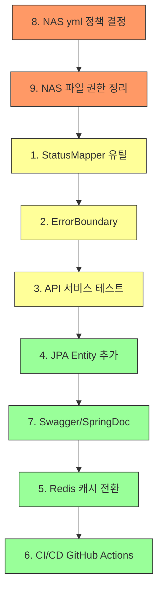

# Bolivia App 개선 항목 실행 가이드

> **작성일**: 2026-03-22 | **대상 프로젝트**: [bolivia-app](file:///c:/project_ai/bolivia-app)

---

## 목차

| # | 항목 | 우선순위 | 현재 상태 | 예상 소요 |
|---|------|---------|----------|----------|
| 1 | [상태값 매핑 유틸 통합 (StatusMapper)](#1-상태값-매핑-유틸-통합) | 🟡 중간 | 미착수 | 2~3h |
| 2 | [프론트엔드 ErrorBoundary 추가](#2-프론트엔드-errorboundary-추가) | 🟡 중간 | 미착수 | 1~2h |
| 3 | [API 서비스 테스트 추가](#3-api-서비스-테스트-추가) | 🟡 중간 | 미착수 | 3~4h |
| 4 | [JPA Entity 점진적 추가 (8개 테이블)](#4-jpa-entity-점진적-추가) | 🟢 낮음 | 미착수 | 4~6h |
| 5 | [BillAdminService 인메모리 캐시 → Redis](#5-인메모리-캐시--redis-전환) | 🟢 낮음 | 미착수 | 3~4h |
| 6 | [CI/CD GitHub Actions](#6-cicd-github-actions) | 🟢 낮음 | 미착수 | 3~4h |
| 7 | [API 문서화 (Swagger/SpringDoc)](#7-api-문서화-swaggerspringdoc) | 🟢 낮음 | 미착수 | 2~3h |
| 8 | [NAS application.yml git 관리 정책](#8-nas-applicationyml-git-관리-정책) | 🟠 정책 | 정책 결정 필요 | 1h |
| 9 | [NAS 파일 권한 정리](#9-nas-파일-권한-정리) | 🟠 수동 | 수동 처리 필요 | 30m |

---

## 1. 상태값 매핑 유틸 통합

### 현재 상황
- [BillAdminService.java](file:///c:/project_ai/bolivia-app/backend/src/main/java/com/bolivia/app/service/BillAdminService.java)의 `mapStatus()` 메서드에 한국어/영어/스페인어 상태값 매핑 로직이 인라인으로 존재
- DB ENUM: `미납`, `완납`, `부분납` / 프론트엔드에서는 i18n 번역 키로 표시
- 다른 테이블(`payments.payment_status`, `reservations.status`, `tasks.status` 등)에도 유사 패턴 필요

### Step 1: 유틸 클래스 생성
```
📁 backend/src/main/java/com/bolivia/app/util/StatusMapper.java
```

```java
package com.bolivia.app.util;

import java.util.Map;

public final class StatusMapper {

    // ── bills.status ──
    private static final Map<String, String> BILL_STATUS = Map.of(
        "미납", "미납",  "Unpaid", "미납",
        "완납", "완납",  "Paid", "완납",   "Pagado", "완납",
        "부분납", "부분납", "Partial", "부분납"
    );

    // ── payments.payment_status ──
    private static final Map<String, String> PAYMENT_STATUS = Map.of(
        "대기", "대기",  "Pending", "대기",
        "완료", "완료",  "Completed", "완료",
        "취소", "취소",  "Cancelled", "취소",
        "실패", "실패",  "Failed", "실패"
    );

    // ── reservations.status ──
    private static final Map<String, String> RESERVATION_STATUS = Map.ofEntries(
        Map.entry("대기", "대기"),  Map.entry("Pending", "대기"),
        Map.entry("승인", "승인"),  Map.entry("Approved", "승인"),
        Map.entry("거절", "거절"),  Map.entry("Rejected", "거절"),
        Map.entry("취소", "취소"),  Map.entry("Cancelled", "취소"),
        Map.entry("완료", "완료"),  Map.entry("Completed", "완료")
    );

    private StatusMapper() {}

    public static String mapBillStatus(String input) {
        return input == null ? null : BILL_STATUS.get(input.trim());
    }

    public static String mapPaymentStatus(String input) {
        return input == null ? null : PAYMENT_STATUS.get(input.trim());
    }

    public static String mapReservationStatus(String input) {
        return input == null ? null : RESERVATION_STATUS.get(input.trim());
    }
}
```

### Step 2: BillAdminService 리팩터링
[BillAdminService.java](file:///c:/project_ai/bolivia-app/backend/src/main/java/com/bolivia/app/service/BillAdminService.java) L245-252에서:

```diff
-    private String mapStatus(String s) {
-        if (s == null) return null;
-        return switch (s.trim()) {
-            case "미납", "Unpaid" -> "미납";
-            case "완납", "Paid", "Pagado" -> "완납";
-            case "부분납", "Partial" -> "부분납";
-            default -> null;
-        };
-    }
+    // StatusMapper.mapBillStatus() 로 대체
```

`validateRow()` 내부도 수정:
```diff
-        String mapped = mapStatus(r.getStatus());
+        String mapped = StatusMapper.mapBillStatus(r.getStatus());
```

### Step 3: 단위 테스트 추가
```
📁 backend/src/test/java/com/bolivia/app/util/StatusMapperTests.java
```
- 각 매핑 메서드에 대해 한국어, 영어, 스페인어 입력 → DB ENUM 출력 검증
- `null`, 빈 문자열, 잘못된 값 → `null` 반환 검증

### 검증
```bash
cd backend && ./gradlew test --tests "com.bolivia.app.util.StatusMapperTests"
```

---

## 2. 프론트엔드 ErrorBoundary 추가

### 현재 상황
- ErrorBoundary 컴포넌트 없음 — React 렌더링 에러 발생 시 전체 앱이 흰 화면으로 크래시

### Step 1: ErrorBoundary 컴포넌트 생성
```
📁 frontend/src/components/common/ErrorBoundary.js
```

```jsx
import React from 'react';

class ErrorBoundary extends React.Component {
  constructor(props) {
    super(props);
    this.state = { hasError: false, error: null };
  }

  static getDerivedStateFromError(error) {
    return { hasError: true, error };
  }

  componentDidCatch(error, errorInfo) {
    console.error('[ErrorBoundary]', error, errorInfo);
  }

  handleReset = () => {
    this.setState({ hasError: false, error: null });
  };

  render() {
    if (this.state.hasError) {
      return (
        <div style={{ padding: 40, textAlign: 'center' }}>
          <h2>⚠️ 오류가 발생했습니다</h2>
          <p>페이지를 새로고침하거나 아래 버튼을 눌러주세요.</p>
          <button onClick={this.handleReset}
                  style={{ padding: '8px 20px', cursor: 'pointer' }}>
            다시 시도
          </button>
        </div>
      );
    }
    return this.props.children;
  }
}

export default ErrorBoundary;
```

### Step 2: App.js에 적용
[App.js](file:///c:/project_ai/bolivia-app/frontend/src/App.js) 최상위 래핑:

```diff
+import ErrorBoundary from './components/common/ErrorBoundary';

 function App() {
   return (
+    <ErrorBoundary>
       <AuthProvider>
         <Router>
           ...
         </Router>
       </AuthProvider>
+    </ErrorBoundary>
   );
 }
```

### Step 3: 테스트
```
📁 frontend/src/components/common/__tests__/ErrorBoundary.test.js
```
- 정상 렌더링 시 children 표시 확인
- 에러 발생 시 fallback UI 표시 확인
- "다시 시도" 클릭 시 정상 복구 확인

### 검증
```bash
cd frontend && npm test -- --watchAll=false --testPathPattern="ErrorBoundary"
```

---

## 3. API 서비스 테스트 추가

### 현재 상황
- 프론트엔드 `services/` 폴더에 8개의 서비스 모듈 존재
- 테스트 파일 없음

### 대상 서비스
| 서비스 | 파일 | 주요 메서드 |
|--------|------|-----------|
| authService | [authService.js](file:///c:/project_ai/bolivia-app/frontend/src/services/authService.js) | login, logout, refreshToken, getCurrentUser, register, changePassword |
| billService | [billService.js](file:///c:/project_ai/bolivia-app/frontend/src/services/billService.js) | getMyBills, getBillDetail 등 |
| http | [http.js](file:///c:/project_ai/bolivia-app/frontend/src/services/http.js) | 인터셉터, 토큰 갱신 로직 |

### Step 1: Mock 설정
```bash
cd frontend && npm install --save-dev axios-mock-adapter
```

### Step 2: authService 테스트 작성
```
📁 frontend/src/services/__tests__/authService.test.js
```

테스트 케이스:
1. `login()` — 정상 로그인 시 응답 반환 확인
2. `login()` — 잘못된 자격증명 시 에러 전파 확인
3. `logout()` — POST `/auth/logout` 호출 확인
4. `refreshToken()` — POST `/auth/refresh` 호출 확인
5. `getCurrentUser()` — GET `/auth/me` 호출 확인

### Step 3: http 인터셉터 테스트 작성
```
📁 frontend/src/services/__tests__/http.test.js
```

테스트 케이스:
1. Access Token이 있을 때 `Authorization` 헤더 자동 부착
2. 401 응답 시 자동 토큰 갱신 후 재시도
3. 갱신 실패 시 `onUnauthorized` 콜백 호출

### Step 4: billService 테스트 작성
```
📁 frontend/src/services/__tests__/billService.test.js
```

### 검증
```bash
cd frontend && npm test -- --watchAll=false --testPathPattern="services/__tests__"
```

---

## 4. JPA Entity 점진적 추가

### 현재 상황
- DB 테이블 15개 중 Entity 6개만 존재 (BaseEntity 제외)
- 기존 Entity: `User`, `Bill`, `Household`, `Announcement`, `Payment`, `RefreshToken`

### 누락 Entity 목록 (8개)

| # | 테이블 | Entity명 | 주요 FK | 비고 |
|---|--------|----------|--------|------|
| 1 | `bill_uploads` | BillUpload | → users | status ENUM |
| 2 | `expenses` | Expense | → users (created_by) | category ENUM |
| 3 | `incomes` | Income | → users (created_by) | category ENUM |
| 4 | `facilities` | Facility | — | facility_type ENUM |
| 5 | `reservations` | Reservation | → facilities, users | status ENUM |
| 6 | `tasks` | Task | → users ×2 | category, priority, status ENUM |
| 7 | `activity_logs` | ActivityLog | → users | — |
| 8 | `file_uploads` | FileUpload | → users | — |

### 작업 순서 (의존성 기준)

**Phase 1** — FK 없는 독립 Entity:
```
Facility → Expense → Income → ActivityLog → FileUpload
```

**Phase 2** — FK 있는 Entity:
```
BillUpload → Reservation(→Facility, User) → Task(→User×2)
```

### 각 Entity 작성 패턴

```java
@Entity
@Table(name = "expenses")
@Getter @Setter @NoArgsConstructor
public class Expense extends BaseEntity {

    @Id
    @GeneratedValue(strategy = GenerationType.IDENTITY)
    private Long id;

    @Enumerated(EnumType.STRING)
    @Column(nullable = false, length = 20)
    private ExpenseCategory category;  // 인건비, 유지보수, 공과금, 보험료, 기타

    @Column(nullable = false)
    private BigDecimal amount;

    private String description;

    @ManyToOne(fetch = FetchType.LAZY)
    @JoinColumn(name = "created_by")
    private User createdBy;
}
```

### Step별 작업

1. **Entity 생성**: `backend/src/main/java/com/bolivia/app/entity/` 하위
2. **ENUM 클래스**: 같은 파일 내 inner enum 또는 별도 파일로 분리
3. **Repository 생성**: `backend/src/main/java/com/bolivia/app/repository/`
4. **ddl-auto 설정**: `validate` 유지 — Entity와 DB 스키마 불일치 시 즉시 감지

### 검증
```bash
# Hibernate validate로 스키마 일치 확인
cd backend && ./gradlew bootRun
# 또는 Docker 환경에서
docker compose up -d --build backend && docker compose logs -f backend | head -50
```

> [!IMPORTANT]
> Entity 추가 시 `ddl-auto=validate`를 유지하여 Entity 정의와 DB 스키마의 일치 여부를 자동 검증합니다. 불일치 시 애플리케이션 기동이 실패하므로 즉각 확인 가능합니다.

---

## 5. 인메모리 캐시 → Redis 전환

### 현재 상황
- [BillAdminService.java](file:///c:/project_ai/bolivia-app/backend/src/main/java/com/bolivia/app/service/BillAdminService.java) L32에서 `ConcurrentHashMap` 기반 인메모리 캐시 사용
- TTL 15분, 수동 cleanup — 서버 재시작 시 데이터 소실, 멀티 인스턴스 불가

### Step 1: Redis 컨테이너 추가
[docker-compose.yml](file:///c:/project_ai/bolivia-app/docker-compose.yml)에 Redis 서비스 추가:

```yaml
  redis:
    image: redis:7-alpine
    container_name: bolivia-redis
    restart: unless-stopped
    ports:
      - "6379:6379"
    networks:
      - bolivia-network
    healthcheck:
      test: ["CMD", "redis-cli", "ping"]
      interval: 10s
      timeout: 5s
      retries: 5
```

`backend` 서비스에 의존성 추가:
```yaml
    depends_on:
      db:
        condition: service_healthy
      redis:
        condition: service_healthy
```

### Step 2: Spring Boot 의존성 추가
[build.gradle](file:///c:/project_ai/bolivia-app/backend/build.gradle):

```gradle
implementation 'org.springframework.boot:spring-boot-starter-data-redis'
```

### Step 3: Redis 설정
```
📁 backend/src/main/resources/application.yml
```
```yaml
spring:
  data:
    redis:
      host: ${REDIS_HOST:redis}
      port: ${REDIS_PORT:6379}
```

### Step 4: BillAdminService 리팩터링

```diff
-private static final Map<String, CachedPreview> PREVIEW_CACHE = new ConcurrentHashMap<>();
+@Autowired private RedisTemplate<String, CachedPreview> redisTemplate;

 // put 시:
-PREVIEW_CACHE.put(tokenKey, new CachedPreview(...));
+redisTemplate.opsForValue().set(tokenKey, cachedPreview, Duration.ofMinutes(15));

 // get 시:
-CachedPreview cached = PREVIEW_CACHE.remove(tokenKey);
+CachedPreview cached = redisTemplate.opsForValue().getAndDelete(tokenKey);
```

> [!WARNING]
> `CachedPreview` record를 Redis에 직렬화하려면 `Serializable` 구현 또는 JSON 직렬화 설정이 필요합니다. `RedisConfig` 클래스에서 `Jackson2JsonRedisSerializer`를 설정하세요.

### Step 5: RedisConfig 생성
```
📁 backend/src/main/java/com/bolivia/app/config/RedisConfig.java
```

### 검증
```bash
# Redis 컨테이너 기동 확인
docker compose up -d redis
docker compose exec redis redis-cli ping
# → PONG

# Backend 재빌드 & 테스트
docker compose up -d --build backend
docker compose logs -f backend | head -30
```

---

## 6. CI/CD GitHub Actions

### 현재 상황
- `.github/` 디렉터리 미존재 — CI/CD 미구성

### Step 1: 워크플로우 파일 생성
```
📁 .github/workflows/ci.yml
```

```yaml
name: Bolivia App CI

on:
  push:
    branches: [main, develop]
  pull_request:
    branches: [main]

jobs:
  backend-test:
    runs-on: ubuntu-latest
    services:
      mysql:
        image: mysql:8.0
        env:
          MYSQL_ROOT_PASSWORD: testroot
          MYSQL_DATABASE: bolivia_test
          MYSQL_USER: testuser
          MYSQL_PASSWORD: testpass
        ports:
          - 3306:3306
        options: >-
          --health-cmd="mysqladmin ping -h localhost"
          --health-interval=10s --health-timeout=5s --health-retries=5
    steps:
      - uses: actions/checkout@v4
      - uses: actions/setup-java@v4
        with:
          java-version: '17'
          distribution: 'temurin'
      - name: Backend Test
        working-directory: backend
        run: ./gradlew test
        env:
          SPRING_DATASOURCE_URL: jdbc:mysql://localhost:3306/bolivia_test
          SPRING_DATASOURCE_USERNAME: testuser
          SPRING_DATASOURCE_PASSWORD: testpass
          JWT_SECRET: ci-test-secret-key-for-testing-only-minimum-length

  frontend-test:
    runs-on: ubuntu-latest
    steps:
      - uses: actions/checkout@v4
      - uses: actions/setup-node@v4
        with:
          node-version: '18'
          cache: 'npm'
          cache-dependency-path: frontend/package-lock.json
      - name: Install Dependencies
        working-directory: frontend
        run: npm ci
      - name: Frontend Test
        working-directory: frontend
        run: npm test -- --watchAll=false

  build-check:
    runs-on: ubuntu-latest
    needs: [backend-test, frontend-test]
    steps:
      - uses: actions/checkout@v4
      - name: Docker Compose Build Check
        run: docker compose build
```

### Step 2: 저장소에 Secrets 설정
GitHub → Settings → Secrets and variables → Actions:
- 필수 Secrets는 CI 내에서 테스트용 값을 인라인으로 사용하므로 초기에는 불필요
- 배포 파이프라인 추가 시 `JWT_SECRET`, `MYSQL_PASSWORD` 등을 Secrets로 등록

### 검증
- `main` 또는 `develop`에 push → Actions 탭에서 워크플로우 실행 확인
- PR 생성 시 자동 검사 실행 확인

---

## 7. API 문서화 (Swagger/SpringDoc)

### Step 1: 의존성 추가
[build.gradle](file:///c:/project_ai/bolivia-app/backend/build.gradle):

```gradle
implementation 'org.springdoc:springdoc-openapi-starter-webmvc-ui:2.3.0'
```

### Step 2: application.yml 설정
```yaml
springdoc:
  api-docs:
    path: /api-docs
  swagger-ui:
    path: /swagger-ui.html
    tags-sorter: alpha
    operations-sorter: method
```

### Step 3: SecurityConfig에서 Swagger 경로 퍼밋
[SecurityConfig](file:///c:/project_ai/bolivia-app/backend/src/main/java/com/bolivia/app/config/SecurityConfig.java) 내 `permitAll` 설정에 추가:

```java
.requestMatchers(
    "/swagger-ui/**",
    "/swagger-ui.html",
    "/api-docs/**",
    "/v3/api-docs/**"
).permitAll()
```

### Step 4: Controller에 어노테이션 추가 (선택)
```java
@Tag(name = "Auth", description = "인증 API")
@Operation(summary = "로그인", description = "사용자 로그인 처리")
@ApiResponse(responseCode = "200", description = "로그인 성공")
```

### 검증
```bash
# 빌드 후 Swagger UI 접속
# 로컬:   http://localhost:8080/swagger-ui.html
# Docker: docker compose up -d --build backend
#         http://localhost:8080/swagger-ui.html
```

---

## 8. NAS application.yml git 관리 정책

### 정책 결정 포인트

| 옵션 | 설명 | 장점 | 단점 |
|------|------|------|------|
| **A. git 추적 + placeholder** | `application.yml`을 git에 포함, 비밀값은 `${ENV_VAR}` placeholder | 설정 구조 버전 관리 | placeholder와 실제값 동기화 관리 필요 |
| **B. git 무시 + 템플릿** | `.gitignore`에 추가, `application.yml.example`만 추적 | 비밀값 유출 원천 차단 | NAS 배포 시 수동 관리 필요 |
| **C. 프로필 분리** | `application.yml`(공통) + `application-nas.yml`(NAS 전용, gitignore) | 환경별 분리 명확 | 파일 관리 복잡도 증가 |

### 권장: **옵션 A (현행 유지 + 강화)**

현재 프로젝트 구조가 이미 `${ENV_VAR}` placeholder 패턴을 사용하고 있으므로:

1. `application.yml`은 git 추적 유지
2. 모든 비밀값은 `${ENV_VAR}` 또는 `${ENV_VAR:-기본값}` 형식
3. `.gitignore`에 추가: `.env`, `.env.local`, `application-local.yml`
4. NAS 환경은 `docker-compose.yml`의 `environment` 섹션에서 주입

### 검증 체크리스트
```bash
# application.yml에 하드코딩된 비밀값이 없는지 검사
grep -rn "password\|secret\|token" backend/src/main/resources/application.yml
# → ${...} 패턴만 존재해야 함
```

---

## 9. NAS 파일 권한 정리

### 현재 문제
- NAS에서 `sudo`로 실행된 파일/디렉터리가 `root:root` 소유로 남아있어 일반 사용자의 접근 불가

### Step 1: 문제 파일 확인
```bash
# NAS SSH 접속 후
find /volume2/docker/bolivia-app -user root -ls
```

### Step 2: 소유권 변경
```bash
# NAS 사용자/그룹에 맞게 변경 (보통 admin:administrators 또는 1000:1000)
sudo chown -R 1000:1000 /volume2/docker/bolivia-app/
```

### Step 3: 디렉터리 권한 설정
```bash
# 디렉터리: 755, 파일: 644
sudo find /volume2/docker/bolivia-app -type d -exec chmod 755 {} \;
sudo find /volume2/docker/bolivia-app -type f -exec chmod 644 {} \;

# 실행 파일 (gradlew 등)
sudo chmod +x /volume2/docker/bolivia-app/backend/gradlew
```

### Step 4: 향후 방지 대책
- `docker compose` 명령은 항상 일반 사용자로 실행
- 필요 시 `docker` 그룹에 사용자 추가: `sudo synogroup --add docker <username>`

### 검증
```bash
# root 소유 파일이 없는지 확인
find /volume2/docker/bolivia-app -user root | wc -l
# → 0
```

---

## 실행 권장 순서



> [!TIP]
> **정책 결정 (8, 9)** → **코드 품질 개선 (1, 2, 3)** → **기능 확장 (4, 7)** → **인프라 (5, 6)** 순서로 진행하면 의존성 충돌 없이 안정적으로 작업할 수 있습니다.
