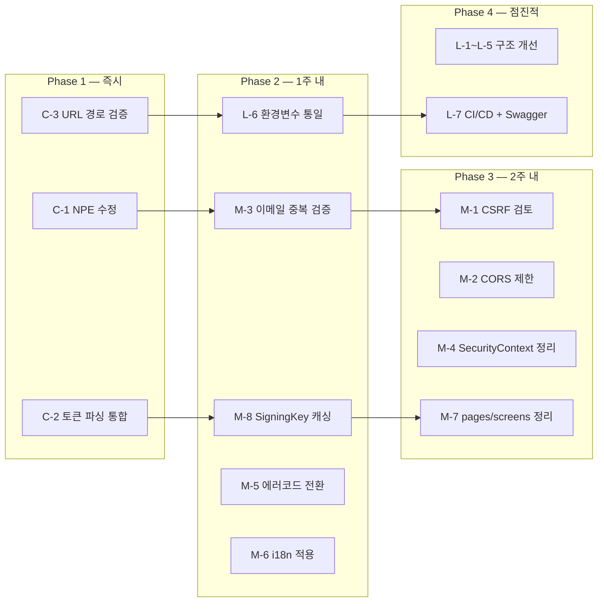

# Bolivia App 문제점 분석 보고서

> **분석일**: 2026-03-22 | **대상**: 로컬 `c:\project_ai\bolivia-app` 코드베이스

---

## 요약

전체 코드베이스 분석 결과 **21건**의 문제점을 발견했습니다.

| 영역 | 🔴 Critical | 🟡 Medium | 🟢 Low | 합계 |
|------|:-----------:|:---------:|:------:|:----:|
| 보안 | 2 | 2 | 1 | **5** |
| 코드 품질 | 1 | 4 | 2 | **7** |
| 구조/아키텍처 | 0 | 3 | 2 | **5** |
| 운영/인프라 | 0 | 2 | 2 | **4** |
| **합계** | **3** | **11** | **7** | **21** |

---

## 🔴 Critical — 즉시 수정 권장

### C-1. JwtAuthenticationFilter — authorities `null`시 NPE 크래시

**파일**: [JwtAuthenticationFilter.java](file:///c:/project_ai/bolivia-app/backend/src/main/java/com/bolivia/app/security/JwtAuthenticationFilter.java#L44-L47)

```java
// L44: authorities가 null이면 .split(",")에서 NullPointerException 발생
String authorities = tokenProvider.getClaimsFromToken(jwt).get("authorities", String.class);
List<SimpleGrantedAuthority> grantedAuthorities = Arrays.stream(authorities.split(","))  // ← NPE!
```

**영향**: Refresh Token으로 생성한 Access Token에는 `authorities` 클레임이 포함되지만, 외부 조작된 토큰이나 마이그레이션 과정 토큰에 해당 클레임이 없을 경우 **전체 요청이 500 에러**로 실패합니다.

**수정 방향**:
```java
String authorities = tokenProvider.getClaimsFromToken(jwt).get("authorities", String.class);
List<SimpleGrantedAuthority> grantedAuthorities;
if (authorities != null && !authorities.isBlank()) {
    grantedAuthorities = Arrays.stream(authorities.split(","))
        .map(SimpleGrantedAuthority::new).collect(Collectors.toList());
} else {
    grantedAuthorities = new ArrayList<>(userDetails.getAuthorities().stream()
        .map(a -> new SimpleGrantedAuthority(a.getAuthority())).toList());
}
```

---

### C-2. JwtTokenProvider — 토큰 2중 파싱 (성능 + 보안)

**파일**: [JwtTokenProvider.java](file:///c:/project_ai/bolivia-app/backend/src/main/java/com/bolivia/app/security/JwtTokenProvider.java)

`JwtAuthenticationFilter`에서 매 요청마다:
1. `validateToken(jwt)` → 토큰 파싱 1회 (L75-78)
2. `getUsernameFromToken(jwt)` → 토큰 파싱 2회 (L64-68)
3. `getClaimsFromToken(jwt)` → 토큰 파싱 3회 (L94-99)

**영향**: 동일 JWT를 **매 요청마다 3번 파싱** — 불필요한 CPU 소비 및 서명 검증 반복.

**수정 방향**: `validateAndGetClaims(String token)` 단일 메서드로 통합하여 1회 파싱으로 Claims 반환.

---

### C-3. SecurityConfig — URL 경로 매핑 불일치

**파일**: [SecurityConfig.java](file:///c:/project_ai/bolivia-app/backend/src/main/java/com/bolivia/app/config/SecurityConfig.java#L69-L72)

```java
// SecurityConfig (L69)
.requestMatchers("/auth/login", "/auth/refresh", "/auth/register").permitAll()
.requestMatchers("/admin/**").hasRole("ADMIN")
.requestMatchers("/resident/**").hasAnyRole("RESIDENT", "ADMIN")
```

```yaml
# application.yml (L3)
server:
  servlet:
    context-path: /api
```

```java
// AuthController (L22)
@RequestMapping("/auth")  // → 실제 경로: /api/auth/login
```

**문제**: `context-path: /api`로 인해 실제 경로는 `/api/auth/login`이지만, `requestMatchers`는 context-path **이후** 경로를 매칭합니다. 현재 동작에는 문제가 없으나, **`/admin/**`과 `/resident/**` 패턴이 실제 컨트롤러 경로와 일치하는지 확인이 필요**합니다.

> [!IMPORTANT]
> 실제 컨트롤러들이 `/admin/` prefix를 사용하는지 확인하세요. `BillAdminController`, `TaskAdminController` 등이 다른 경로를 사용할 경우 **권한 우회 가능성**이 있습니다.

---

## 🟡 Medium — 조기 수정 권장

### M-1. CSRF 보호 완전 비활성화

**파일**: [SecurityConfig.java](file:///c:/project_ai/bolivia-app/backend/src/main/java/com/bolivia/app/config/SecurityConfig.java#L63)

```java
.csrf(AbstractHttpConfigurer::disable)
```

JWT Stateless 환경에서 CSRF를 비활성화하는 것은 일반적이지만, **Refresh Token이 httpOnly 쿠키**로 전달되므로 쿠키 기반 CSRF 공격에 여전히 노출됩니다.

**수정 방향**: `/api/auth/refresh` 엔드포인트에 한해 SameSite=Strict 검증 또는 커스텀 CSRF 헤더(예: `X-Requested-With`) 확인을 추가.

---

### M-2. CORS — 허용 헤더 와일드카드

**파일**: [SecurityConfig.java](file:///c:/project_ai/bolivia-app/backend/src/main/java/com/bolivia/app/config/SecurityConfig.java#L85)

```java
configuration.setAllowedHeaders(List.of("*"));  // 모든 헤더 허용
```

**수정 방향**: 필요한 헤더만 명시: `Authorization`, `Content-Type`, `Accept`, `X-Requested-With`

---

### M-3. UserService — 이메일 변경 시 중복 검증 누락

**파일**: [UserService.java](file:///c:/project_ai/bolivia-app/backend/src/main/java/com/bolivia/app/service/UserService.java#L27-L28)

```java
if (profileDto.getEmail() != null) {
    user.setEmail(profileDto.getEmail());  // 중복 체크 없음!
}
```

`users.email`은 UNIQUE 제약조건이 있어 DB 레벨에서 에러가 발생하지만, 사용자에게 **`DataIntegrityViolationException` 500 에러**가 반환됩니다.

**수정 방향**: `userRepository.existsByEmail()` 호출 후 `DuplicateResourceException` 던지기.

---

### M-4. AuthService.login() — 불필요한 SecurityContext 설정

**파일**: [AuthService.java](file:///c:/project_ai/bolivia-app/backend/src/main/java/com/bolivia/app/service/AuthService.java#L61)

```java
SecurityContextHolder.getContext().setAuthentication(authentication);  // 불필요
```

JWT Stateless 앱에서 로그인 시점에 SecurityContext를 설정해도 **같은 요청 내에서만 유효**하며 즉시 사라집니다. 코드 가독성에 혼란을 줍니다.

---

### M-5. BillService — 에러 메시지 한국어 하드코딩

**파일**: [BillService.java](file:///c:/project_ai/bolivia-app/backend/src/main/java/com/bolivia/app/service/BillService.java#L53)

```java
throw new AccessDeniedException("이 청구서에 대한 접근 권한이 없습니다");
```

백엔드 레거시 한국어 메시지가 다국어 전략과 충돌. 에러 코드 방식 전환 필요.

---

### M-6. AuthContext.js — Toast 메시지 하드코딩 (i18n 미적용)

**파일**: [AuthContext.js](file:///c:/project_ai/bolivia-app/frontend/src/contexts/AuthContext.js#L83-L88)

```javascript
toast.success('로그인에 성공했습니다');       // L83 — 한국어 하드코딩
toast.error('로그인에 실패했습니다');         // L88 — i18n 미적용
toast.success('로그아웃되었습니다');          // L105
```

**수정 방향**: `useTranslation()` Hook을 사용할 수 없는 Context에서는 `i18n.t()` 직접 호출로 대체.

---

### M-7. App.js — `pages/`와 `screens/` 이중 라우팅 구조

**파일**: [App.js](file:///c:/project_ai/bolivia-app/frontend/src/App.js)

- `App.js`는 `pages/` 디렉터리의 컴포넌트만 라우팅 (23개 import)
- `screens/` 디렉터리에 17개의 화면이 존재하지만 **어디서 라우팅되는지 불명확**

**영향**: 두 가지 가능성:
1. `screens/`는 모바일 앱(React Native) 전용이지만 코드가 섞여 있음
2. `screens/`는 사용되지 않는 레거시 코드

어느 쪽이든 혼란을 초래하므로 정리가 필요합니다.

---

### M-8. JwtTokenProvider — `getSigningKey()` 매 호출마다 새 SecretKey 생성

**파일**: [JwtTokenProvider.java](file:///c:/project_ai/bolivia-app/backend/src/main/java/com/bolivia/app/security/JwtTokenProvider.java#L29-L31)

```java
private SecretKey getSigningKey() {
    return Keys.hmacShaKeyFor(jwtSecret.getBytes(StandardCharsets.UTF_8));  // 매번 생성
}
```

**수정 방향**: `@PostConstruct`에서 한 번만 생성 후 캐싱:
```java
private SecretKey signingKey;

@PostConstruct
void init() {
    this.signingKey = Keys.hmacShaKeyFor(jwtSecret.getBytes(StandardCharsets.UTF_8));
}
```

---

## 🟢 Low — 개선 권장

### L-1. User Entity — SRP 위반 (Entity + UserDetails 혼합)

**파일**: [User.java](file:///c:/project_ai/bolivia-app/backend/src/main/java/com/bolivia/app/entity/User.java)

`User` 클래스가 `BaseEntity`를 상속하면서 `UserDetails`를 구현하여 JPA Entity와 Spring Security 인증 세부사항이 혼합되어 있습니다.

---

### L-2. i18n — 레거시 `config.js` 파일 잔존

**파일**: [config.js](file:///c:/project_ai/bolivia-app/frontend/src/i18n/config.js)

`index.js`와 별도로 존재하며 키 구조가 다름. import 여부에 따라 번역 충돌 가능.

---

### L-3. ErrorBoundary 부재

React 렌더링 에러 시 전체 앱이 흰 화면으로 크래시. [이전 가이드](file:///c:/project_ai/bolivia-app/docs/2026-03-22_improvement_guide.md) 참조.

---

### L-4. JPA Entity 부족

15개 DB 테이블 중 6개만 Entity 매핑 완료. 8개 테이블 누락.

---

### L-5. 프론트엔드 서비스 테스트 전무

`services/` 폴더의 8개 서비스 모듈에 대한 단위 테스트가 전혀 없음.

---

### L-6. docker-compose.yml — 환경변수 키 불일치

**파일**: [docker-compose.yml](file:///c:/project_ai/bolivia-app/docker-compose.yml#L38-L41) vs [application.yml](file:///c:/project_ai/bolivia-app/backend/src/main/resources/application.yml#L48-L54)

| 항목 | docker-compose | application.yml |
|------|---------------|----------------|
| JWT Secret | `APP_JWT_SECRET`, `JWT_SECRET` (2개!) | `${JWT_SECRET}` |
| Cookie Domain | `APP_JWT_COOKIE_DOMAIN` | `${COOKIE_DOMAIN}` |
| Cookie Secure | `APP_JWT_COOKIE_SECURE` | `${COOKIE_SECURE}` |

환경변수 키가 일치하지 않아 **값이 제대로 주입되지 않을 수 있음**.

> [!WARNING]
> `docker-compose.yml`의 `APP_JWT_COOKIE_DOMAIN`은 `application.yml`의 `${COOKIE_DOMAIN}`과 **키가 다릅니다**. 현재 docker-compose로 실행하면 cookie-domain이 기본값 `localhost`로 고정됩니다.

---

### L-7. CI/CD 및 API 문서화 미구성

`.github/` 디렉터리 미존재, Swagger/SpringDoc 미설정.

---

## 우선순위별 수정 로드맵


